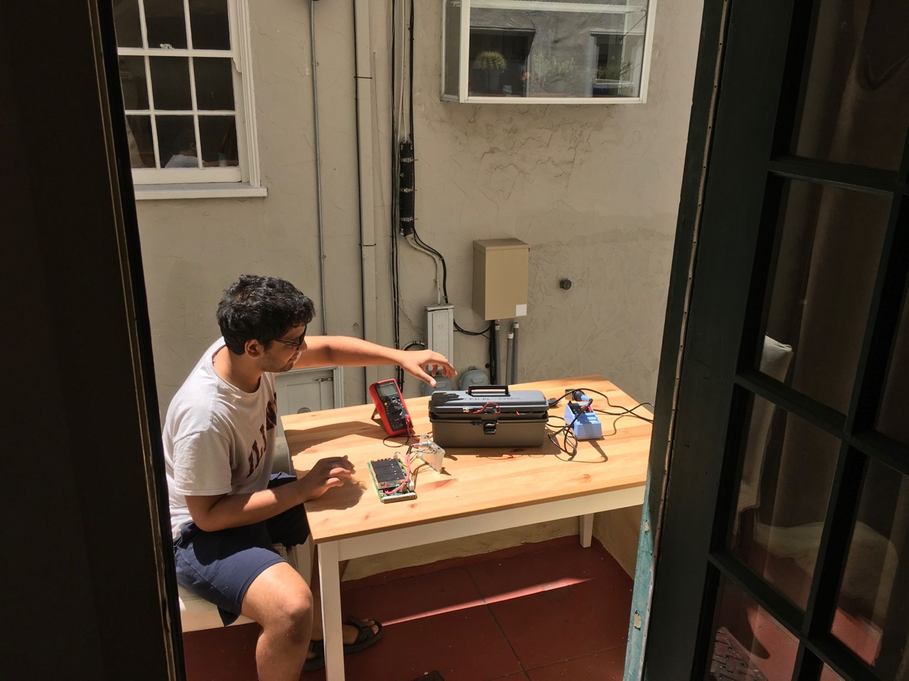

Keywords: spatial patterns of particulate matter, mobile sampling, mass spectrometry, vehicular emissions, cooking emissions

## **Summary** 
We measured spatial differences in airborne particulate matter (PM) in Oakland, CA, with repeated mobile measurements on all city streets. In addition to primary, we also find higher secondary organic PM downtown, which suggests stronger photochemical PM production in areas of high emissions and poor air ventilation (i.e., urban street canyons). This finding is original because while other modeling studies have predicted higher photochemistry in street canyons, we confirm this observationally.

## **Behind the scenes** 

Yes, we drove our instrumented van from Pittsburgh, PA to Berkeley, CA. And yes, it was beautiful, especially once we were west of Kansas (some pictures below).

Though the paper says that the measurement campaign began on 10th July 2017, it was originally supposed to begin on 24th June 2017. However, upon arrival in Berkeley, we discovered that our instrument was not working. We ended up spending 2 weeks trying to fix the instrument. This involved taking apart the instrument again and again, ruling out one potential source of malfunction after the next. Every day was the same drill: open a part of the instrument, visually inspect the complex circuitry, take lots of pictures, put it back together. And all this while also exchanging emails and phone calls with the instrument manufacturer, desperate shouts for help in the Berkeley area, even a trip up to Davis, CA, in the hopes of getting diagnostic help from researchers at UC Davis. Finally, it turned out to be a bad electric connection in a high-voltage unit of the instrument. Here's a picture of me preparing a soldering station to fix this connection at our AirBnB.

And now, here are some pictures of the road trip:
> *Colorado* 
> *Wyoming* 
> *Utah* 
> *Nevada* 
> *California* 
