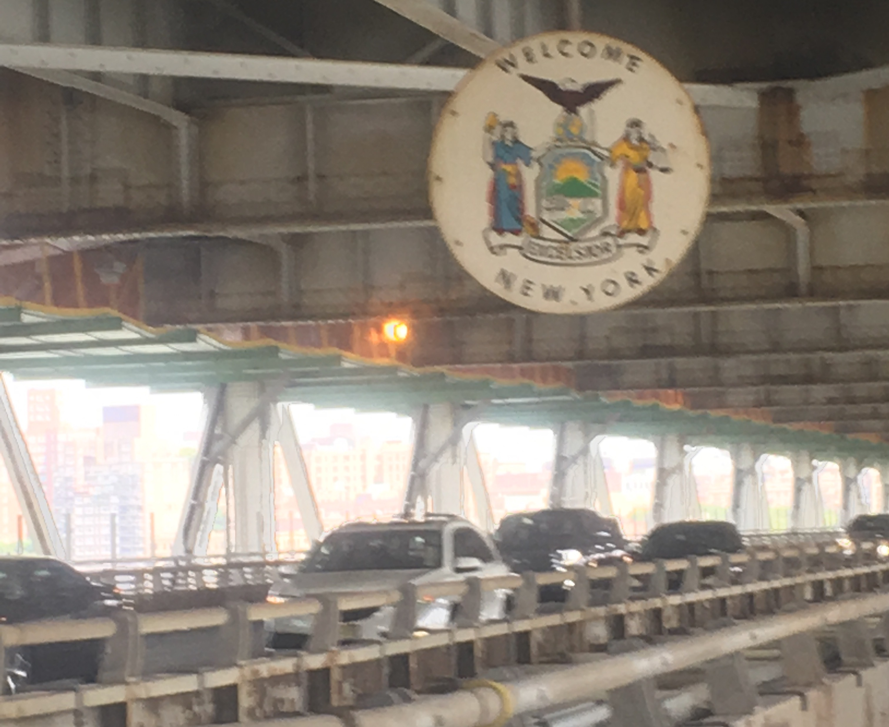

---
abstract:
authors:
- admin
- Matthew M. Coggon
- Georgios I. Gkatzelis
- Brian C. McDonald
- Antonios Tasoglou
- Heinz Huber
- Jessica Gilman
- Carsten Warneke
- Allen L. Robinson
- Albert A. Presto
date: "2019-12-19"
doi: "10.1021/acs.est.9b06531"
featured: false
image:
  caption: ''
  focal_point: ""
  preview_only: false
projects: []
publication: '*Environmental Science and Technology*'
publication_short: '*Environmental Science and Technology*'
publication_types:
- "2"
publishDate: "2019-12-19"
summary: 

title: Urban Oxidation Flow Reactor Measurements Reveal Significant Secondary Organic Aerosol Contributions from Volatile Emissions of Emerging Importance
url_code: ""
url_dataset: ""
url_pdf: ""
url_poster: ""
url_project: ""
url_source: ""
url_video: ""
---
Keywords: urban secondary PM, volatile emissions, fragrances, vehicular emissions

## **Summary:**
This study shows a significant pool of emissions of volatile organic compounds from non-combustion sources in urban environments. Non-combustion sources include personal care products, paints, adhesives, and other petrochemical products. We used an oxidation flow reactor (OFR) to demonstrate that there is excess secondary particulate matter formation potential in densely populated areas because of this pool of vapors.

## **Behind the scenes:**
Figure 4 of this paper shows about 30 min of data collected by two instrumented vans driving alongside each other around a construction site in Pittsburgh. The NOAA van measured the amounts of different reactive organic gases (e.g., those emitted from deodorants, paints, etc.) in the air, while the Carnegie Mellon van oxidized this air to measure the reactivity of these gases. 

Incidentally, this 30 min of sampling in Pittsburgh was just a test of whether or not this sampling strategy would work. Having gotten encouraging results, we next planned to apply this promising sampling strategy in populous parts of Manhattan e.g., Times Square, where the population density would be very high, and thus we would be able to observe a strong signal of personal care products.

We thus drove to New York City, and set up our base at the City College of New York main campus in Harlem. We started making detailed plans about how to perform our mobile sampling: we planned routes, we planned times of day to sample, we even planned a sampling route from Morristown, NJ to Stony Brook, NY (cutting right through Manhattan, of course), hoping to capture the rural-urban-rural gradient of various air pollutants.

And then, of course, the most vital instrument on the Carnegie Mellon van malfunctioned (the same instrument that also malfunctioned a year earlier in [Oakland](https://rishabhshah.netlify.app/publication/acp-oakland/)). Unlike Oakland, however, we could not revive the instrument in time for the planned measurements this time. I hope someone else gets an opportunity to do the measurements that I could not.

Fortunately, the data collected while we were stationary at our base station in Harlem proved immensely useful. These are the data are ended up being in this paper! And, while it was a much shorter road trip than the one from [Pittsburgh to Oakland](https://rishabhshah.netlify.app/publication/acp-oakland/), I did manage to take a few pictures on the road:

> 
> 